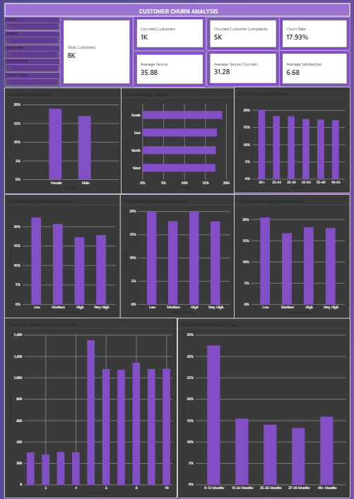

# 📱 Customer Churn Analysis Dashboard

## 📌 Project Overview

The **Customer Churn Analysis Dashboard** is an interactive **Power BI dashboard** developed for a telecom company experiencing a high customer churn rate.

The dashboard analyzes **customer demographics, usage patterns, tenure, satisfaction scores, complaints, and regional trends** to identify factors associated with customer churn.

The objective is to help the customer service team **identify at-risk customer segments and support proactive customer retention strategies**.

---

## 🎯 Objectives

* Analyze the overall customer churn rate
* Identify age groups with high churn
* Analyze customer usage patterns
* Understand the relationship between data usage and churn
* Analyze the average tenure of churned customers
* Identify regions with high churn rates
* Analyze customer satisfaction scores
* Understand complaints raised by churned customers
* Compare churn rates by gender
* Identify usage patterns associated with potential churn
* Analyze how churn varies with customer tenure

---

## 📊 Key KPIs

* 📉 Overall Churn Rate
* ⏳ Average Customer Tenure
* 😊 Customer Satisfaction Score
* 👥 Total Customers
* 🔄 Churned Customers
* 📞 Average Call Minutes
* 📶 Average Data Usage
* 💬 Total Complaints

---

## 🖥️ Dashboard Preview



---

## 📈 Dashboard Analysis

The dashboard answers key business questions such as:

1. What is the overall churn rate?
2. Which age groups have the highest churn?
3. How does data usage relate to customer churn?
4. What is the average tenure of churned customers?
5. Which regions have the highest churn rate?
6. What is the distribution of customer satisfaction scores?
7. How many complaints were raised by churned customers?
8. What is the churn rate by gender?
9. Which usage patterns indicate potential churn?
10. How does churn vary by customer tenure?

---

## 🗂️ Data Model

The project consists of three main tables:

### 👥 Customers

* CustomerID
* Name
* Age
* Gender
* Region
* Tenure
* Churn

### 📞 Usage

* CustomerID
* CallMinutes
* DataUsage
* MessagesSent

### 😊 Feedback

* CustomerID
* SatisfactionScore
* Complaints

### 🔗 Relationships

```text
Customers
    │
    ├──────── Usage
    │
    └──────── Feedback
```

* Usage.CustomerID → Customers.CustomerID
* Feedback.CustomerID → Customers.CustomerID

---

## 🛠️ Tools & Technologies

* **Power BI** – Dashboard development and visualization
* **Power Query** – Data cleaning and transformation
* **DAX** – KPI calculations and analytical measures
* **Excel / CSV** – Data source
* **Data Modeling** – Establishing relationships between tables

---

## 🔄 Project Workflow

```text
Raw Customer Data
        ↓
Data Cleaning & Transformation
        ↓
Data Modeling
        ↓
DAX Measures & KPIs
        ↓
Interactive Power BI Dashboard
        ↓
Churn Analysis
        ↓
Customer Retention Insights
```

---

## 💡 Business Insights

The dashboard helps identify:

* Customer segments with higher churn
* Regions experiencing higher churn rates
* Relationship between customer tenure and churn
* Customer satisfaction patterns among churned customers
* Complaint patterns associated with churn
* Usage behaviors that may indicate churn risk
* Demographic groups with higher churn rates

These insights can help customer service teams focus their retention efforts on **high-risk customer segments**.

---

## 📁 Project Structure

```text
Customer-Churn-Analysis/
│
├── Customer Churn Dataset
│
├──  Customer Churn Analysis.pbix
│
├──  Customer Churn Analysis Case
│
├── customer_churn_analysis.png
│
└── README.md
```

---

## 🚀 How to Use

1. Clone or download this repository.
2. Open the `.pbix` file using **Microsoft Power BI Desktop**.
3. If required, update the dataset source path.
4. Refresh the data.
5. Explore the dashboard using the available filters and visualizations.

---

## 🎓 Learning Outcomes

Through this project, I practiced:

* Data cleaning and transformation
* Data modeling in Power BI
* DAX calculations
* KPI development
* Customer churn analysis
* Data visualization
* Interactive dashboard design
* Business requirement analysis
* Translating business questions into data-driven insights

---

## 👩‍💻 Author

**Sejal Patil**

B.Sc. Information Technology | Data Analytics Enthusiast

### Skills Demonstrated

`Power BI` `DAX` `Power Query` `Data Analysis` `Data Visualization` `Data Modeling` `Excel`

---

⭐ **If you find this project useful, feel free to star the repository!**
